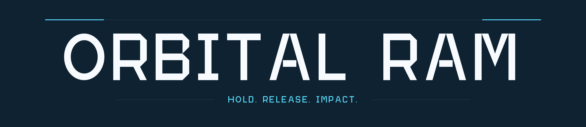

# Hi, I'm Azizbek Adizov

**Unity game developer · AI & Machine Learning student · Bukhara, Uzbekistan**

I make games with simple controls and physical interactions. I'm learning through building, playtesting, and improving projects, with a focus on Unity, C#, and browser games.

## Play my latest game

**Orbital Ram** is a one-button arena action game about timing, momentum, and collisions. Hold to orbit around an anchor, then release to launch your robot ball into mechanical enemies.

- Endless enemy waves and five bosses with different attacks.
- Permanent upgrades and 15 achievements.
- Free to play in desktop and mobile browsers; public playtesting is open.

**[Play Orbital Ram on itch.io →](https://adizoff.itch.io/orbital-ram)**

I'd love to hear which wave you reached and how the controls felt. You can leave feedback on the game page.

Developed with AI assistance; music generated with Suno. Full development disclosure is on the game page. The source repository remains private.

## Learning & projects

I'm studying Artificial Intelligence and Machine Learning at **Acharya University** while developing my game development skills.

- **[Space Shooter — course project](https://github.com/Adizoff/SpaceShooter-Course):** my first Unity project, built through GameDevHQ to learn 2D movement, spawning, collisions, and C# gameplay scripting.
- **Current focus:** readable controls, physics-based gameplay, boss encounters, and WebGL delivery across desktop and mobile.
- **Tools I work with:** Unity, C#, Blender, Git, and GitHub. I also study Python for AI/ML.

## Find me

[itch.io](https://adizoff.itch.io) · [LinkedIn](https://www.linkedin.com/in/adizoff) · [Instagram](https://www.instagram.com/pixelexpl0rer) · [Email](mailto:adizoff99@gmail.com)
